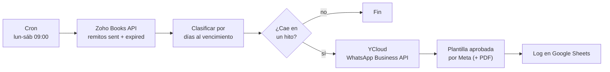

# Cobranza automática por WhatsApp Business API

Automatización en producción para Berta, agencia de marketing de Leones, Córdoba.
Lee los remitos pendientes en Zoho Books y le manda a cada cliente una secuencia de recordatorios por WhatsApp, con el PDF del remito adjunto, a través de la API oficial de WhatsApp Business.

| Métrica (septiembre 2026) | Valor |
|---------------------------|-------|
| Mensajes de cobranza enviados | 115 |
| Remitos enviados en PDF | 29 |
| Mensajes fallidos | 0 |
| Trabajo manual que reemplaza | ~3 h por mes |
| Costo de envío | ~USD 4 por mes |

## El problema

El seguimiento de cobros era 100% manual: la administrativa revisaba qué remitos vencían, mandaba el PDF y los recordatorios por WhatsApp uno por uno y perseguía a los morosos de memoria. Sin registro de qué se había mandado y dependiendo de que alguien se acordara el día justo.

## La solución

Un workflow de n8n que corre **de lunes a sábado a las 09:00**. Trae de Zoho Books los remitos enviados y vencidos, calcula cuántos días faltan para cada vencimiento y, si el remito está en uno de los hitos, manda la plantilla que corresponde.

## Secuencia de recordatorios

| Hito | Mensaje |
|------|---------|
| 12 días antes | Envío del remito en PDF + aviso de vencimiento |
| 7 días antes | Recordatorio preventivo |
| Día del vencimiento | Aviso de vencimiento |
| 3 días después | Primer seguimiento |
| 7 días después | Segundo seguimiento |

Los vencimientos son los días 10 y 20 de cada mes. Los remitos se generan el día 25 del mes anterior ([automatizacion-remitos](https://github.com/rami-fresia/automatizacion-remitos)) justamente para que el aviso de 12 días tenga el remito disponible.

## Decisiones técnicas

**Migración a la API oficial.** La primera versión mandaba los mensajes con Evolution API, una integración no oficial que vincula WhatsApp como si fuera un dispositivo más. Al empezar a mandar en volumen, WhatsApp restringió el número por mensajería masiva: los mensajes a chats nuevos quedaban en `PENDING` y nunca llegaban. Lo diagnostiqué consultando el estado real de cada mensaje en la base de Evolution (pendiente vs. entregado), probé con sesiones nuevas para descartar un problema de conexión y confirmé la causa con el aviso de restricción en el teléfono. La solución fue migrar a la **WhatsApp Business Cloud API a través de YCloud** (BSP oficial de Meta), en modo coexistencia para que el número siga usándose desde el celular, con **plantillas aprobadas por Meta**. Desde la migración no hubo un solo mensaje fallido.

**Hitos que caen domingo.** El workflow no corre los domingos, y con disparadores de día exacto un hito que caía domingo se perdía. Ahora esos hitos se corren al lunes.

**Logs que dicen la verdad.** En la versión original el log escribía `enviado_ok` como texto fijo, aunque el envío hubiera fallado. Así pasaron días con mensajes sin entregar y la planilla diciendo que todo estaba bien. Desde entonces el estado de entrega se controla contra el proveedor (YCloud reporta enviado, entregado, leído o fallido para cada mensaje), no contra lo que el workflow cree que hizo.

**Alertas fuera del canal que se cae.** El Error Workflow avisa por mail y no por WhatsApp: si el problema es justo el canal de WhatsApp, una alerta por WhatsApp no llega nunca.

**Plantillas genéricas.** Las plantillas no incluyen el número de remito, así un cliente con dos remitos en el mismo hito recibe dos mensajes claros en lugar de uno ambiguo, y Meta las aprueba más fácil.

## Workflow

*Captura de la versión original con Evolution API. La versión actual mantiene la misma estructura (Zoho, clasificación por fecha, loop por cliente con espera entre envíos, log) con los nodos de envío apuntando a YCloud.*

## Stack

- **n8n** self-hosted (Docker + EasyPanel en un VPS)
- **Zoho Books API v3**: fuente de remitos y PDFs
- **YCloud**: WhatsApp Business Cloud API (BSP oficial de Meta)
- **Google Sheets**: log de envíos
- **JavaScript**: clasificación por fechas y armado de mensajes

## Seguridad

Este repositorio no contiene credenciales, números de teléfono ni datos de clientes. Las API keys viven cifradas en el gestor de credenciales de n8n.
